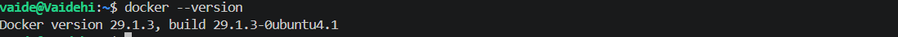
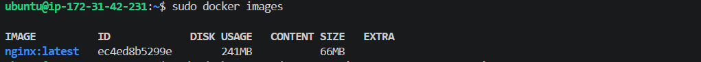
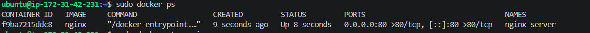
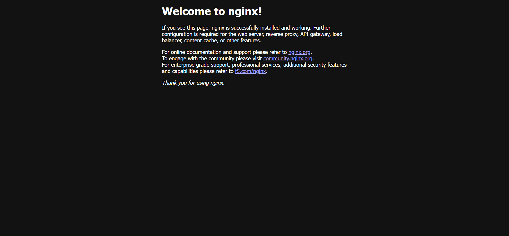

# EC2 Docker NGINX Deployment

## Project Overview

This project demonstrates how to deploy an NGINX web server inside a Docker container on an AWS EC2 Ubuntu instance. The project includes launching an EC2 instance, connecting using WSL (Ubuntu), installing Docker, running the NGINX container with port mapping, verifying the deployment, and cleaning up the resources.

---

## Objectives

- Launch an AWS EC2 Ubuntu instance
- Connect using WSL (Ubuntu)
- Install Docker
- Download the NGINX Docker image
- Run the NGINX container
- Map container port 80 to EC2 port 80
- Access the NGINX web page
- Stop the container
- Stop the EC2 instance

---

## Prerequisites

- AWS Account
- Ubuntu EC2 Instance
- WSL (Ubuntu)
- SSH Key (.pem)
- Docker

---

## Connect to EC2

```bash
chmod 400 docker-key.pem
ssh -i docker-key.pem ubuntu@<EC2-PUBLIC-IP>
```

---

## Install Docker

```bash
sudo apt update
sudo apt install docker.io -y
sudo systemctl start docker
sudo systemctl enable docker
```

Verify installation:

```bash
docker --version
```

---

## Pull the NGINX Image

```bash
sudo docker pull nginx
```

Verify image:

```bash
sudo docker images
```

---

## Run the Container

```bash
sudo docker run -d --name nginx-server -p 80:80 nginx
```

Verify container:

```bash
sudo docker ps
```

---

## Access NGINX

Open your browser and visit:

```
http://<EC2-PUBLIC-IP>
```

You should see the **Welcome to nginx!** page.

---

## Cleanup

Stop the container:

```bash
sudo docker stop nginx-server
```

Remove the container:

```bash
sudo docker rm nginx-server
```

Exit the server:

```bash
exit
```

Stop the EC2 instance from the AWS Console.

---

## Screenshots

### EC2 Instance Running


---

### Docker Version



---

### Docker Images



---

### Running Container



---

### NGINX Welcome Page



---

### EC2 Instance Stopped


---

## Technologies Used

- AWS EC2
- Ubuntu 24.04 LTS
- Docker
- NGINX
- WSL (Ubuntu)

---

## Author

**Vaidehi Gupta**